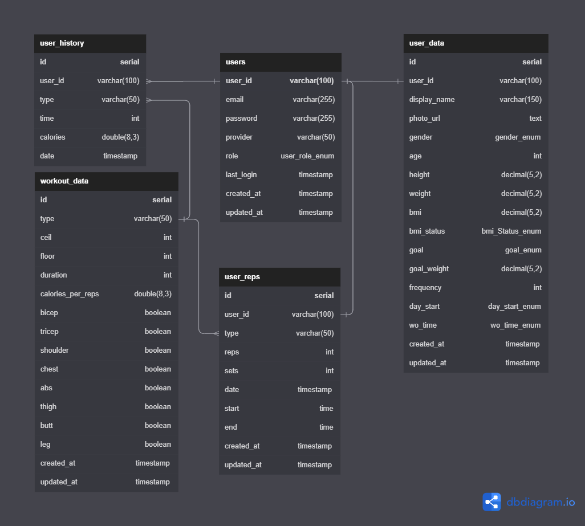
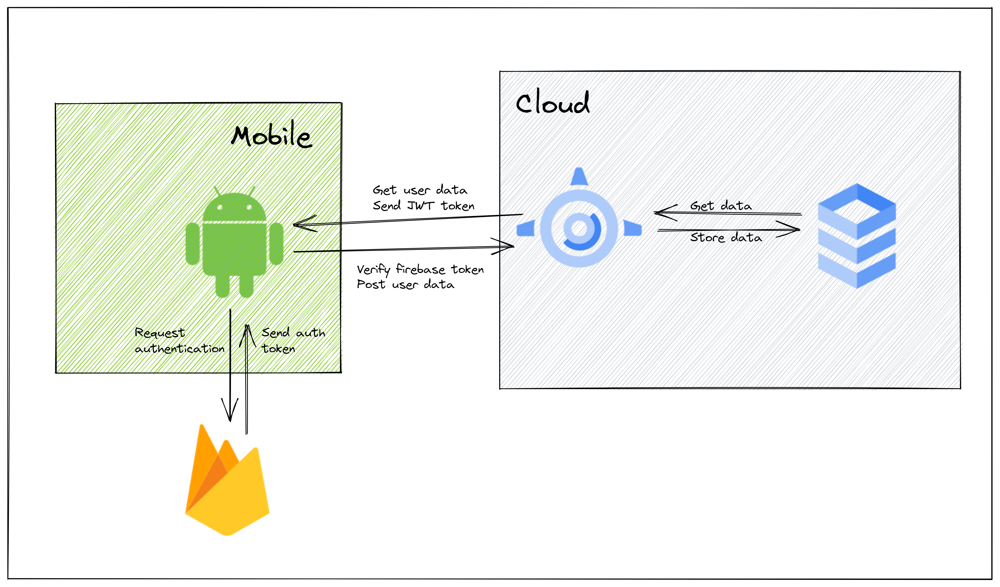

# MoveMate Backend
This is backend for the [MoveMate-Android](https://github.com/pdshi/MoveMate-Android) app

# Pre-requisites
- Install [Node.js](https://nodejs.org/en/) version 18.16.0


# Getting started
- Clone the repository
```
git clone https://github.com/pdshi/movemate-backend
```
- Install dependencies
```
cd movemate-backend
npm install
```
- Build and run the project
```
npm start
```
  API path to `http://localhost:3030`


## Project Structure
The folder structure of this app is explained below:

| Name | Description |
| ------------------------ | --------------------------------------------------------------------------------------------- |
| **node_modules**         | Contains all  npm dependencies                                                            |
| **src**                  | Contains  source code that will be compiled to the dist dir                               |
| **src/config**        | Application configuration including environment-specific configs 
| **src/controllers**      | Controllers define functions to serve various express routes. 
| **src/middleware**      | Express middlewares which process the incoming requests before handling them down to the routes
| **src/routes**           | Contain all express routes, separated by module/area of application                       
| **src/models**           | Models define schemas that will be used in storing and retrieving data from Application database  |
| index.js         | Entry point to express app                                                               |
| package.json             | Contains npm dependencies as well as build scripts   | tsconfig.json            | Config settings for compiling source code only written in TypeScript    


## Database Diagram

this diagram is made using dbdiagram, access the diagram [here](https://dbdiagram.io/d/64649a35dca9fb07c43dfbdd)

## Cloud Implementation scheme



## Documentation
The API documentation can be accessed here: [https://documenter.getpostman.com/view/27783730/2s93sW9G6b](https://documenter.getpostman.com/view/27783730/2s93sW9G6b)

